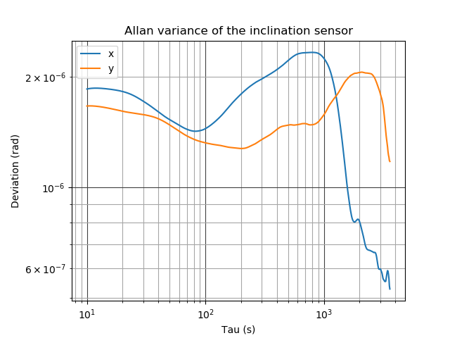
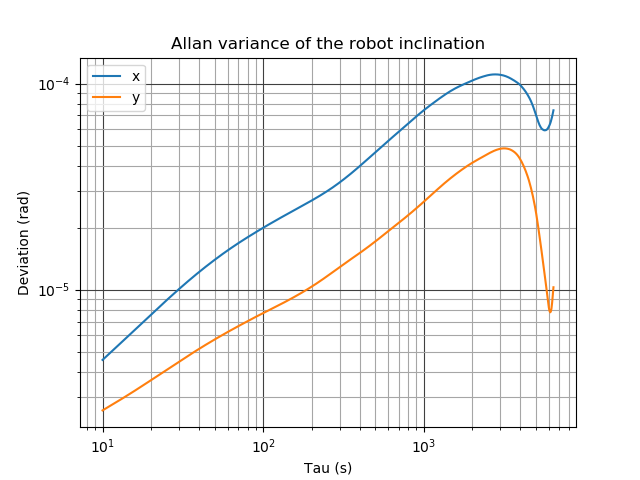

## Allan plots

Comparision of the Allan variance of the inclination sensor on a granite plate (reference) and the inclination sensor on the robot. It can be clearly seen, that the robot drift dominates the inclination inaccuracy at the measured timescales, when no live correction is applied.

### Allan variance of the inclination sensor on a granite plate:

### Allan variance of the inclination sensor on the robot:

